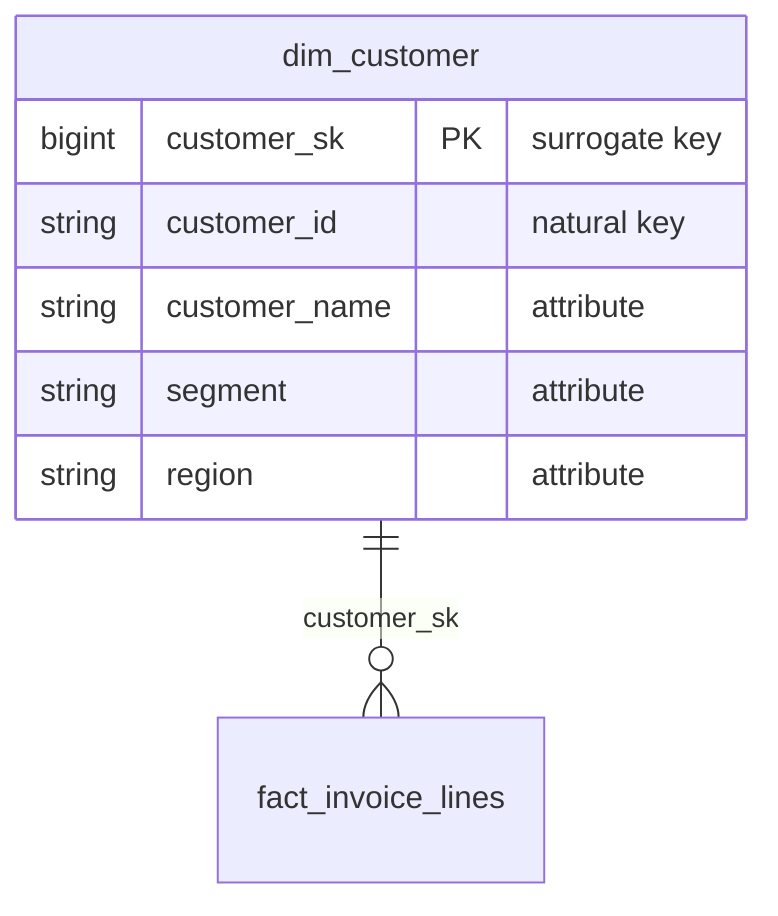

# Dimension

A **dimension** is a table that provides the descriptive context around the
measurable events stored in a [fact table](./star-schema.md). Where facts answer
*"how much?"* or *"how many?"*, dimensions answer *"who, what, where, when, and
why?"* — they hold the attributes analysts use to filter, group, and label
results. Together with facts they form the [star schema](./star-schema.md). See
[Dimension Tables (Kimball Group)](https://www.kimballgroup.com/data-warehouse-business-intelligence-resources/kimball-techniques/dimensional-modeling-techniques/dimensions-dimension-table/)
for the original definition.

## What is a dimension

A dimension table describes a single business entity — a customer, a product, a
sales territory, a date. Each row is one member of that entity, and the columns
are the textual or low-cardinality attributes that describe it.

- **Wide and shallow.** Dimensions typically have many columns but relatively few
  rows compared to facts. Denormalize attributes into the dimension rather than
  snowflaking them into sub-tables.
- **Attributes are the filters and labels.** Anything you would `group by` or put
  on a report axis belongs in a dimension (e.g. `category`, `region`, `segment`).
- **One row per member version.** With history tracking, a single business entity
  can occupy several rows over time — see [Slowly Changing Dimension](../definitions/slowly-changing-dimension.md).
- **No fact-to-fact context here.** Keep numeric, additive measures in the fact
  table; the dimension holds context, not metrics.



## Natural Keys

The **natural key** is the identifier the entity already carries in the **source
system** — a `customer_id` from the CRM, an SKU from the product catalogue, an
order number from the OLTP database.

- Carries business meaning and may be reused, recycled, or reformatted by the
  source.
- Can be composite (several columns) and can change format over time.
- Stored on the dimension (often suffixed `_nk`) so a row can be traced back to
  its source record.
- **Not** used as the primary key of the dimension: a single natural key can map
  to many historical versions of a row once you track history.

```text
customer_id = "CUST-00417"
```

## Surrogate Keys

The **surrogate key** is a meaningless, warehouse-generated integer that serves as
the **primary key** of the dimension. Every row — including every historical
version of an entity — gets its own surrogate key, and fact tables join to the
dimension through it.

- Typically a monotonically increasing `BIGINT` or identity column; carries no
  business meaning.
- Decouples the warehouse from source-key changes and enables Type 2 history.
- Reserve special values (e.g. `-1` Unknown, `-2` Not applicable) so fact foreign
  keys never have to be `NULL`.

> **Convention:** name surrogate keys `<entity>_sk`, e.g. `customer_sk`,
> `product_sk`, `date_sk`.

```text
customer_sk = 1048576   -- primary key of one specific version of a customer row
```

For the full set of key types and the conventions we use for each, see
[Kimball Keys Definitions](./kimball-keys.md).

## See also

- [Star Schema](./star-schema.md) — how dimensions surround a fact table
- [Kimball Keys Definitions](./kimball-keys.md) — natural, surrogate, durable, and foreign keys
- [Slowly Changing Dimension](../definitions/slowly-changing-dimension.md) — tracking attribute history
- [Grain](../definitions/grain.md) — the atomic level of a fact table

## References

- [Dimension Tables — Kimball Group](https://www.kimballgroup.com/data-warehouse-business-intelligence-resources/kimball-techniques/dimensional-modeling-techniques/dimensions-dimension-table/)
- [Fact Tables and Dimension Tables](https://www.kimballgroup.com/2003/01/fact-tables-and-dimension-tables/) — foundational definitions
- [Surrogate Keys](https://www.kimballgroup.com/data-warehouse-business-intelligence-resources/kimball-techniques/dimensional-modeling-techniques/surrogate-key/) — why warehouses generate their own keys
