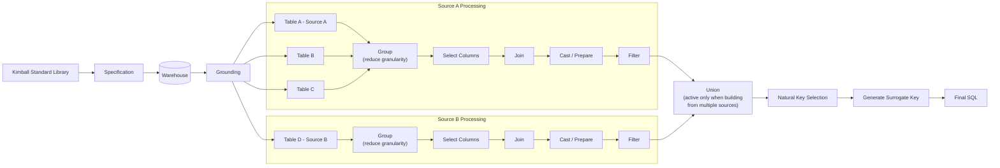

Perspective handles these steps automatically. We document them here in detail so that analysts can understand the process and work in sync with Perspective's lineage generation.

## Transformation Diagram

## Transformation Steps

Building a dimension typically follows three stages: create source-specific dimensions, unify them into a single consolidated dimension, and add surrogate keys.

### 1. Create Source Dimensions

When consolidating a dimension from multiple sources, start by creating one dimension table per source. Each source dimension should contain only the attributes coming from that system, cleaned and renamed to use business-friendly column names.

For example, if you are consolidating the `sales_territory` dimension from SAP and Infor, you should create:

* `sap_sales_territory` — contains territory attributes as they come from SAP
* `infor_sales_territory` — contains territory attributes as they come from Infor

This keeps each source isolated, making it easier to debug data quality issues back to their origin. It also means changes in one source system don't ripple into the transformation logic of another.

Each source dimension is built through a series of sub-steps. Think of these as individual CTEs or queries that you chain together — each one does exactly one thing.

#### 1.1 Select

Start by selecting only the columns you need from the raw or staging tables. This is the first filter — strip away everything that doesn't belong in the dimension.

* pick the columns that will become attributes in the final dimension
* rename columns to use business-friendly names at this stage (e.g. `VKORG` → `sales_org`)
* drop any operational or system columns that have no analytical value (e.g. `_etl_loaded_at`, `last_modified_by`)

Keep it minimal. If you're unsure whether a column belongs, leave it out — you can always add it later.

#### 1.2 Group

Aggregate rows when the raw data is at a finer grain than the dimension needs. This typically happens when the source table has one row per transaction or event, but the dimension should have one row per entity.

* use `group by` on the natural key columns of the dimension
* apply aggregation functions (`max`, `min`, `count`, `sum`) only where they make analytical sense
* be explicit about which value you're keeping when multiple rows collapse into one — don't rely on implicit behaviour

Not every dimension needs a grouping step. If the source is already at the right grain (one row per entity), skip this step entirely.

#### 1.3 Prepare

Transform raw values into clean, consistent formats. This step is about data quality, not business logic.

Typical operations:

* `cast` — enforce correct data types (e.g. string dates to `DATE`, numeric codes to `INTEGER`)
* `trim` / `upper` / `lower` — normalize text values for consistency
* `coalesce` — fill in defaults for nullable columns where a default makes sense
* `case when` — map coded values to human-readable labels (e.g. `'A'` → `'Active'`, `'I'` → `'Inactive'`)

Avoid doing too much here. If a transformation requires joining to another table or involves complex business rules, it belongs in a later step.

#### 1.4 Join

Enrich the dimension by joining attributes from related tables. This is where you bring together data that lives across multiple tables within the same source system.

* use `left join` by default — you want to keep all dimension records even if the related table has gaps

#### 1.5 Filter

Apply any filters that determine which records should be included in the dimension. This step is intentionally last so that you're filtering on clean, transformed data.

* exclude soft-deleted records, test data, or inactive entities that shouldn't appear in reporting
* document the filter criteria clearly — future analysts need to understand why certain records are excluded
* if a filter is business-critical (e.g. "only include customers with at least one order"), call it out with a comment explaining the business rule

The filtering rules should be defined by the user in the business requirements, not inferred by LLM.

### 2. Unify Source Dimensions

Once the source dimensions are in place, combine them into a single unified dimension. The unified dimension should:

* union or merge records from all source dimensions into a common schema
* resolve column naming differences — pick one business name and stick with it
* handle duplicates across sources by defining a clear deduplication strategy (e.g. prefer SAP over Infor when records overlap)

Following our example, this step produces:

* `unified_sales_territory`

Keep the unification logic straightforward. If the mapping between sources is complex, consider adding an intermediate staging step rather than cramming everything into one query.

#### 2.1 Union

Stack all source dimensions into a single consolidated table using `UNION ALL`. At this stage, the unified dimension does not yet have natural or surrogate keys — it is simply all source records brought together under a common schema.

* every source dimension must have the same column names and data types before unioning — this is why the renaming and casting in step 1 matters
* use `UNION ALL`, not `UNION` — you want to preserve all rows, including apparent duplicates. Deduplication is a separate, explicit step
* add a `source_system` column (e.g. `'SAP'`, `'Infor'`) so you can always trace a record back to its origin

> **Note**: if the dimension is built from a single source (no `UNION` required), do **not** add the `source_system` column to the final dimension. It carries no analytical value when there is only one source and would just be noise. The `source_system` column is only meaningful when multiple sources are unified and traceability between them matters.

#### 2.2 Deduplicate (optional)

If the same entity exists in multiple source systems, you need a strategy to resolve duplicates. This step only applies when sources overlap — if each source contributes entirely distinct records, skip it.

* define a priority order across sources (e.g. SAP is the master for territory data, Infor fills gaps)
* use `row_number()` partitioned by the business key and ordered by source priority, then keep only the first row
* document the deduplication logic clearly — this is one of the most common sources of confusion in unified dimensions

### 3. Add Keys to the Unified Dimension

After unification, identify the natural key columns and generate a surrogate key. The final dimension table follows the `dim_` naming convention. For our example:

* `dim_sales_territory`

#### 3.1 Identify Natural Keys

Determine which columns uniquely identify a record in the unified dimension. Natural keys are the business identifiers that come from the source systems — they are what the business already uses to refer to an entity.

* a natural key can be a single column (e.g. `territory_code`) or a composite of multiple columns (e.g. `territory_code` + `source_system`)
* always append `_nk` to natural key columns (e.g. `territory_code_nk`, `source_system_nk`) so they are immediately recognizable in the schema — this mirrors the `_sk` convention used for surrogate keys
* (optional) after identifying the natural keys, verify uniqueness: run a `group by` on the `nk_` columns and confirm every group has exactly one row. If duplicates remain, revisit your deduplication logic in step 2.2

> Note: the rules for selecting the columns for SCD Type 2 dimensions have yet to be decided.

#### 3.2 Generate Surrogate Key

The surrogate key is **always** an MD5 hash of the combined natural key — that is, a hash of all natural key columns concatenated together. This makes the key deterministic and reproducible across pipeline runs, which is essential for idempotent loads.

* concatenate all natural key columns into a single string, using the `|` separator to avoid collisions between values like `('AB', 'C')` and `('A', 'BC')`
* apply the `md5` hash function to produce the surrogate key
* name the surrogate key column `<dimension_name>_sk` (e.g. `sales_territory_sk`) so it's immediately recognizable as a surrogate key in fact table joins

> **Note on SCD Type 2 dimensions**: for slowly changing dimensions of Type 2, hashing only the natural keys will produce duplicate surrogate keys across historical versions of the same entity (e.g. the same `territory_code` appearing with different `territory_name` values over time). This is acceptable in Kimball-style modelling — from an analytics perspective, the natural key is all a data analyst needs to reason about the dimension, and duplicate surrogate keys are fine as long as only one row is flagged as active at any point in time. Joins from fact tables should filter on `WHERE is_active = TRUE` (or equivalent) to pick the current version. There is no need to think in terms of database primary keys here; the analytical model does not require surrogate key uniqueness.

#### 3.3 Select Final Columns

Select the final set of columns for the dimension table. This is where you decide what the consumers of the dimension will see.

* place the surrogate key as the first column
* include the natural key columns for traceability back to the source systems
* include the `source_system` column from step 2.1
* include all descriptive attributes from the unified dimension
* order columns logically — keys first, then identifiers, then descriptive attributes. A well-ordered dimension is easier to scan and query

