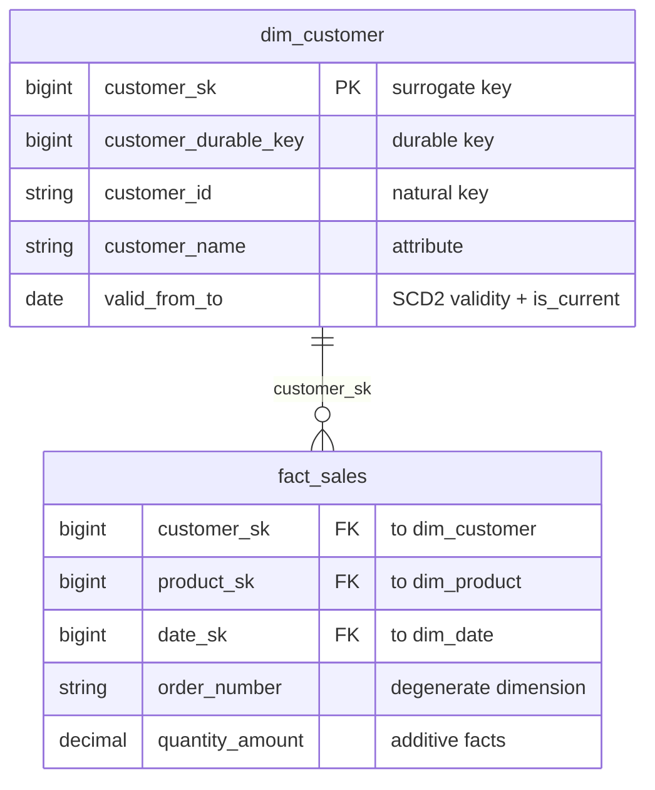

# Kimball Keys Definitions

In the Kimball dimensional modelling approach, **keys** are the backbone that
connect fact tables to their dimensions and that let us track history correctly.
This page defines the key types you will encounter and the conventions we use for
each.

## Quick reference

| Key | Lives in | Stable? | Meaningful? | Purpose |
|-----|----------|---------|-------------|---------|
| Natural key | Source system | Yes (in source) | Yes | Identifies a business entity in the source |
| Durable / supernatural key | Dimension | Yes (forever) | No | Identifies an entity across all source changes |
| Surrogate key | Dimension | Per row version | No | Primary key of a dimension row |
| Foreign key | Fact | — | No | Points a fact row at a dimension row |
| Degenerate dimension | Fact | Yes | Yes | Operational identifier with no dimension table |

---

## Natural key

The identifier an entity carries in the **source system** — for example a
`customer_id` from the CRM, an SKU from the product catalogue, or an order number
from the OLTP database.

- Carries business meaning and may be reused or recycled by the source.
- Can be composite (several columns) and can change format over time.
- **Not** used as the primary key of a dimension, because a single natural key
  can map to many historical versions of a row (see surrogate keys).

```text
customer_id = "CUST-00417"
```

## Durable (supernatural) key

A **warehouse-assigned, never-changing** identifier for a business entity. While
surrogate keys change with every new version of a row, the durable key stays
constant for the lifetime of the entity.

- Use it to group all historical versions of the same entity.
- Survives source-system migrations and natural-key reformatting.
- Sometimes called a *persistent* or *supernatural* key.

```text
customer_durable_key = 90231   -- one value for CUST-00417 across all versions
```

## Surrogate key

A **meaningless, warehouse-generated** integer that serves as the **primary key**
of a dimension table. Every row in the dimension — including every historical
version of an entity — gets its own surrogate key.

- Typically a monotonically increasing integer (`BIGINT`) or an identity column.
- Carries no business meaning; never expose it to end users as a "real" id.
- Decouples the warehouse from source-key changes and enables Type 2 history.

> **Convention:** name surrogate keys `<entity>_sk`, e.g. `customer_sk`,
> `product_sk`, `date_sk`.

```text
customer_sk = 1048576   -- primary key of one specific version of a customer row
```

### Why a surrogate key instead of the natural key?

1. **Slowly changing dimensions (SCD Type 2).** When an attribute changes we add
   a *new* row with a *new* surrogate key, preserving the old version.
2. **Performance.** Single-column integer joins are faster and smaller than wide
   or composite natural keys.
3. **Insulation.** Source-system key changes don't ripple into facts.
4. **Late-arriving / unknown members.** Reserved surrogate values can represent
   "Unknown" or "Not applicable" rows.

## Foreign key

The column in a **fact table** that stores a dimension's surrogate key, forming
the join between the fact and that dimension.

- One foreign key per dimension the fact relates to.
- Always points at a surrogate key, never at a natural key.
- Should be enforced (logically, at minimum) so every fact row resolves to a
  valid dimension row — including the special "Unknown" member.

```text
fact_sales.customer_sk  -->  dim_customer.customer_sk
```

## Degenerate dimension

A dimension key that lives **in the fact table itself** because it has no
interesting attributes of its own and therefore no separate dimension table.
Classic examples: invoice number, order number, transaction id.

- Useful for grouping the line items of a single operational document.
- Stored as a column on the fact, often suffixed `_id` or `_number`.

```text
fact_invoice_lines.invoice_number = "INV-2026-008812"
```

---

## Special dimension members

Reserve a handful of surrogate key values for rows that don't map to real source
records, so that fact foreign keys never have to be `NULL`:

| Surrogate key | Member meaning |
|---------------|----------------|
| `-1` | Unknown |
| `-2` | Not applicable |
| `-3` | Missing / not yet arrived |

---

## Putting it together



A fact row joins to a *specific version* of a customer via `customer_sk`. To
analyse an entity across all its versions, group on `customer_durable_key`. To
trace a record back to the source, use the `customer_id` natural key.
