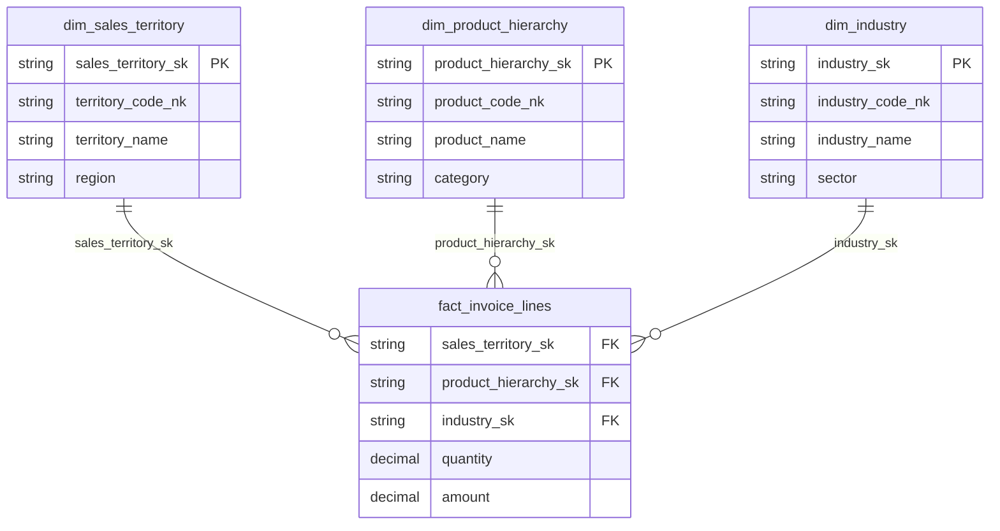

# Star Schema

A star schema is the foundational pattern in dimensional modelling. It organizes data into a central **fact table** surrounded by **dimension tables**, forming a star-like shape when visualized. The fact table holds measurable events (e.g. orders, shipments, invoices), while the dimensions provide the context around those events (e.g. customer, product, territory). See [Star Schema (Kimball Group)](https://www.kimballgroup.com/data-warehouse-business-intelligence-resources/kimball-techniques/dimensional-modeling-techniques/star-schema-olap-cube/) for the original definition.

This structure is optimized for analytical queries. Because every dimension joins directly to the fact table, queries are predictable — analysts always know where to look for metrics (facts) and where to look for filters and groupings (dimensions).

## Example Star Schema Diagram

## Rules

### One fact table per star schema

Each star schema should contain exactly one fact table at one grain. The grain is the business definition of the measurement event that creates a fact record — it should always start at the lowest, most atomic level. If you need to combine metrics from different business processes (e.g. sales and inventory), build separate star schemas rather than merging everything into a single fact table. This keeps each schema focused and avoids grain conflicts. See [Four-Step Dimensional Design Process](https://www.kimballgroup.com/data-warehouse-business-intelligence-resources/kimball-techniques/dimensional-modeling-techniques/four-4-step-design-process/) and [Keep to the Grain](https://www.kimballgroup.com/2007/07/keep-to-the-grain-in-dimensional-modeling/) for more on defining grain.

### Do not join dimensions to other dimensions

In dimensional modelling, joining a dimension to another dimension is known as an [outrigger dimension](https://www.kimballgroup.com/data-warehouse-business-intelligence-resources/kimball-techniques/dimensional-modeling-techniques/outrigger-dimension/). While the Kimball methodology technically allows outriggers, they are rarely necessary and they complicate the SQL logic — queries become harder to read, maintain, and optimize. As Kimball notes, outriggers should be used sparingly, and in most cases correlations between dimensions should be demoted to a fact table where both dimensions are represented as separate foreign keys. See also [Design Tip #105: Snowflakes, Outriggers, and Bridges](https://www.kimballgroup.com/2008/09/design-tip-105-snowflakes-outriggers-and-bridges/).

If you find yourself wanting to join two dimensions together, use a [factless fact table](https://www.kimballgroup.com/data-warehouse-business-intelligence-resources/kimball-techniques/dimensional-modeling-techniques/factless-fact-table/) instead. A factless fact table captures the relationship between dimensions as a fact at its own grain — it has no numeric measures, only foreign keys to the dimensions involved. This keeps the star schema clean and the joins predictable. See [Design Tip #133: Factless Fact Tables for Simplification](https://www.kimballgroup.com/2011/04/design-tip-133-factless-fact-tables-for-simplification/) for practical examples.

### Always use left joins, fact on the left

When joining dimensions to the fact table, always use `left join` with the fact table on the left side. This ensures that every fact record is preserved in the result, even if a matching dimension record is missing.

* a missing dimension match usually indicates a data quality issue — the `left join` makes these gaps visible rather than silently dropping rows
* if you use `inner join` instead, you risk losing fact records and underreporting metrics without realizing it

### Keep aggregate calculations in the reporting layer

The star schema should store atomic, grain-level data. Derived calculations like percentages, ratios, running totals, and year-over-year comparisons belong in the reporting or semantic layer — not in the fact table itself.

* storing pre-aggregated values in facts makes them inflexible — they can't be re-sliced by dimensions they weren't originally grouped by
* let the reporting tool handle aggregation so that analysts can drill down to the detail when needed
* the one exception is [additive measures](https://www.kimballgroup.com/data-warehouse-business-intelligence-resources/kimball-techniques/dimensional-modeling-techniques/additive-semi-additive-non-additive-fact/) (e.g. `quantity`, `amount`) — these belong in the fact table because they can be meaningfully summed across any dimension. Semi-additive measures (e.g. balances) can be summed across some dimensions but not all, and non-additive measures (e.g. unit prices, ratios) should never be summed directly

For more on aggregate tables as a performance optimization, see [Aggregate Fact Tables (Kimball Group)](https://www.kimballgroup.com/data-warehouse-business-intelligence-resources/kimball-techniques/dimensional-modeling-techniques/aggregate-fact-table-cube/).

## References

* [Dimensional Modeling Techniques — Kimball Group](https://www.kimballgroup.com/data-warehouse-business-intelligence-resources/kimball-techniques/dimensional-modeling-techniques/) — complete list of techniques
* [A Dimensional Modeling Manifesto](https://www.kimballgroup.com/1997/08/a-dimensional-modeling-manifesto/) — the original case for dimensional modelling
* [Fact Tables and Dimension Tables](https://www.kimballgroup.com/2003/01/fact-tables-and-dimension-tables/) — foundational definitions
* [Kimball Dimensional Modeling Techniques (PDF)](https://www.kimballgroup.com/wp-content/uploads/2013/08/2013.09-Kimball-Dimensional-Modeling-Techniques11.pdf) — comprehensive reference document