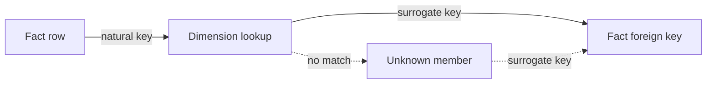

# Key Strategy
## Overview
A fact always obtains a dimension surrogate key by resolving it from the dimension. The fact never generates the surrogate key itself - regardless of how the key is generated, whether by a sequence / identity integer or by hashing. Every dimension row needs a stable surrogate key, and every fact needs to point at the right dimension row through that key.

In practice - **the hash hybrid**. The surrogate key is generated in one place - **the dimension** - by hashing its natural key:
1. The dimension hashes its natural key to generate the surrogate key.
2. The fact looks up the dimension to retrieve and assign the correct surrogate key - it never hashes the key itself, including the fallback.

The convention is about where the key is resolved, not how it is generated. Hashing is simply an implementation of surrogate key generation.



## The dimension owns the key

Even where the match isn't a simple one-to-one lookup, the key still comes from
the dimension - the fact never fills the gap itself. Two cases illustrate this:

- **Unknown member.** The [Unknown member](../patterns/unknown.md) is an ordinary dimension row with natural
  key `'UNKNOWN'`. When a fact cannot resolve its natural key, it reads the Unknown
  member's surrogate key from the dimension as well - the fallback is looked up, not
  generated in the fact.
- **SCD Type 2.** In an SCD Type 2 dimension the surrogate key is version-specific.
  The fact resolves the version-correct row using the natural key and the event date,
  then takes that row's surrogate key.

Both are still lookups: an unresolved key lands on the Unknown row, and multiple
versions resolve to the one valid at the event date. In neither case does the fact
generate the key.

## Example: Key assignment in practice
 Resolve the key on the natural key, falling back to the Unknown member - both keys read from the dimension.

 The `CROSS JOIN` below is only an example of how to make the single Unknown dimension row available to every fact row. The Unknown member is not matched on the fact's natural key; it is made available as the fallback value for each row.

```sql
WITH unknown_customer AS (
    SELECT
        customer_sk
    FROM dim_customer
    WHERE customer_nk = 'UNKNOWN'
)
SELECT
    f.order_id,
    f.amount,
    COALESCE(d.customer_sk, unk.customer_sk) AS customer_sk -- both from the dimension
FROM fact_orders AS f
LEFT JOIN dim_customer AS d
    ON d.customer_nk = f.customer_nk
CROSS JOIN unknown_customer AS unk;
```

## Example: SCD Type 2 key assignment

For an [SCD Type 2](slowly-changing-dimension.md) dimension, the fact resolves the dimension row that was valid at the time of the event. The lookup therefore uses both the **natural key** and the **event date**.

The Unknown member is also resolved from the dimension. The example below uses a `LEFT JOIN` to make the Unknown surrogate key available as a fallback; this is an alternative implementation to the `CROSS JOIN` shown above.

```sql
WITH unknown_customer AS (
    SELECT customer_sk
    FROM dim_customer
    WHERE customer_nk = 'UNKNOWN'
)
SELECT
    f.order_id,
    f.order_date,
    f.customer_nk,
    COALESCE(d.customer_sk, unk.customer_sk) AS customer_sk
FROM fact_orders AS f
LEFT JOIN dim_customer AS d
    ON d.customer_nk = f.customer_nk
    AND f.order_date >= d.valid_from_date
    AND f.order_date < d.valid_to_date
LEFT JOIN unknown_customer AS unk
    ON d.customer_sk IS NULL;
```

For example, if the dimension contains two versions of a customer and an Unknown member:

| customer_nk | customer_sk  | valid_from_date | valid_to_date |
| ----------- | ------------ | --------------- | ------------- |
| C001        | `SK_1`       | 2026-01-01      | 2026-07-01    |
| C001        | `SK_2`       | 2026-07-01      | 9999-12-31    |
| UNKNOWN     | `SK_UNKNOWN` | —               | —             |

An order dated `2026-05-15` resolves to `SK_1`, while an order dated `2026-08-10` resolves to `SK_2`. If no matching dimension version exists, the fact resolves to `SK_UNKNOWN`.

## Don't resolve keys in the fact

Generating or re-deriving a surrogate key inside the fact is the one thing this
convention rules out. The key already exists in the dimension; recomputing it on
the fact side produces the same value in two places, and the moment the
dimension's rule changes the two drift apart and the join quietly stops matching.

```sql
-- AVOID: the fallback key is re-derived in the fact instead of read from the dimension
SELECT
    f.order_id,
    f.amount,
    COALESCE(d.customer_sk, MD5('UNKNOWN')) AS customer_sk -- the fact recomputes the key instead of looking it up
FROM fact_orders AS f
LEFT JOIN dim_customer AS d
    ON d.customer_nk = f.customer_nk;
```

## Key Takeaways
- A fact resolves the surrogate key by **lookup**, never by generating it itself - and this holds whether the dimension's key is a sequence or a hash.
- The **hash hybrid** realisation: the dimension hashes the natural key to make the key; the fact only retrieves it, including the Unknown fallback.
- The **Unknown** member is a normal dimension row (`'UNKNOWN'` natural key); its key is read from the dimension, not hardcoded or recomputed.
- **SCD Type 2** keys are version-specific; the fact resolves the correct dimension version using the natural key and event date.

## Related

- [Kimball Keys Definitions](../concepts/kimball-keys.md) — natural, surrogate, durable, and foreign keys
- [Keys (assignment transformation)](../transformations/keys-assignments.md) — the pipeline step this page standardises
- [Unknown member](../patterns/unknown.md) — the reserved dimension row
- [Slowly Changing Dimension](slowly-changing-dimension.md) — why SCD Type 2 keys are version-specific
- [Naming conventions](naming.md) — the `_sk`, `_nk` prefixes