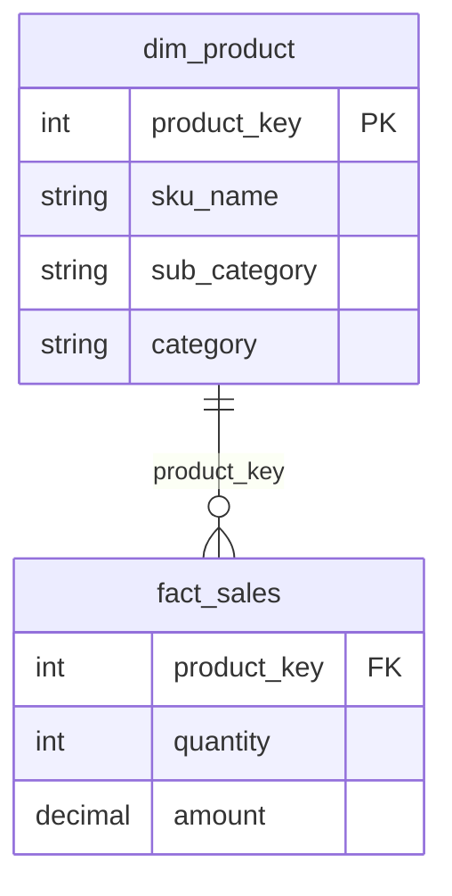
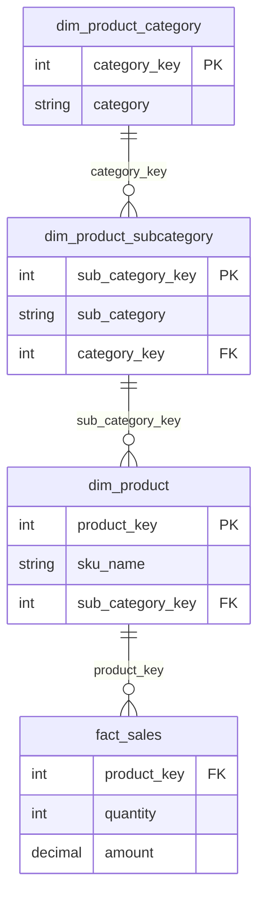

# Outrigger

An outrigger is a secondary dimension table that joins to another dimension table rather than directly to a fact table. While pure Kimball dimensional modeling strongly prefers flat, denormalized tables, outriggers exist to solve specific data modeling edge cases without cluttering or degrading your main data model.

## General Rule

The baseline Kimball rule is to **denormalize whenever possible**. Attributes from related entities should ideally be collapsed directly into the primary dimension table to maintain a clean star schema. Outriggers are permissible exceptions, but their use must always be intentionally justified.

## When to Use

Denormalization is the preferred default because keeping attributes in a single table maintains a pure star schema, maximizes storage/query efficiency, and simplifies BI reporting hierarchies.

However, using an outrigger is justified in the following scenarios:

* Differing Rates of Change: When a small subset of attributes changes far more frequently than the primary dimension, splitting them into an outrigger prevents excessive row growth under Slowly Changing Dimension (SCD) Type 2 tracking.

* Shared/Reusable Attribute Sets: When a complex block of attributes (like geographic regions or census demographics) applies identically to multiple distinct dimensions (e.g., both Customer and Store).

* High vs. Low Cardinality Mismatch: When a primary dimension contains millions of rows, but secondary descriptive data repeats across small, static groups.

## How it works

Below is a comparison showing the standard denormalized model alongside an outrigger approach.

_1. Standard Approach (Denormalized / Flat Dimension)_

By default, product attributes (subcategory and category) live directly inside dim_product.

_2. Outrigger Approach (Normalized Sub-dimensions)_

When justified, hierarchy levels are split into separate outrigger dimensions linked by foreign keys.

## Implementation Considerations

* Query Performance: Outriggers introduce extra joins. While modern cloud data warehouses handle joins well, traversing deep outrigger chains can increase query latency for end-user reporting.

* BI Tool Usability: Overusing outriggers turns a simple star schema into a complex snowflake schema, making self-service BI queries harder for non-technical business users.

* Maintenance Overhead: Outriggers require managing additional surrogate keys and ETL loading steps to handle key assignments across dependent tables.

## Key Takeaways

* Default to flat, denormalized dimensions inside your star schema whenever possible.

* Use outriggers sparingly—reserve them for reusability across dimensions or preventing massive SCD Type 2 table bloat.

* Avoid building deep outrigger chains (more than 1–2 layers deep) to prevent turning your star schema into an overly complex snowflake model.
