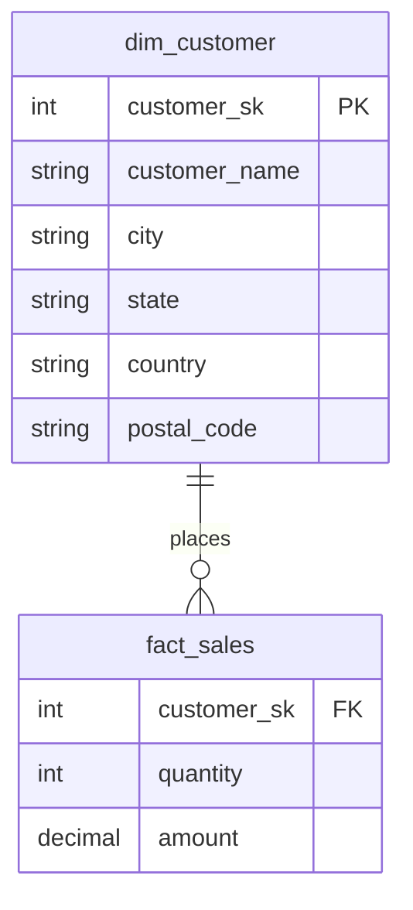
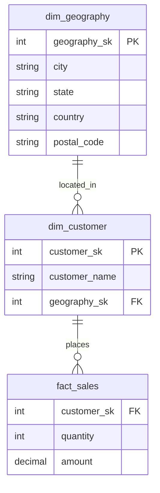

# Outrigger

## Overview

An outrigger is a secondary dimension table that joins to a primary dimension table rather than connecting directly to a fact table.

It is important to distinguish an outrigger from general snowflaking. While snowflaking typically decomposes a full multi-level hierarchy (such as Product → Subcategory → Category) into normalized tables, an outrigger is specifically a standalone secondary dimension referenced by a primary dimension—often to hold reusable or distinct attribute groups.

## Recommended Approach

The baseline approach in Kimball modeling is to prefer flat, denormalized dimensions. Attributes from related entities should ideally be collapsed directly into the primary dimension table to keep the star schema clean and intuitive.

Outriggers should generally be introduced only where the additional structure provides a clear modeling benefit. Rather than treating this as a rigid rule with a fixed list of permitted cases, evaluate the trade-offs between schema simplicity and data design efficiency for your specific use case.

## When to Use

Denormalization remains the preferred default because keeping attributes in a single table maximizes query efficiency and simplifies reporting for business users.

However, introducing an outrigger can be appropriate in scenarios such as:

- **Shared/Reusable Attribute Sets:** When a cohesive block of attributes applies identically across multiple distinct dimensions—such as a single `dim_geography` table referenced by both `dim_customer` and `dim_store`.
- **High vs. Low Cardinality Mismatches:** When a primary dimension contains millions of rows, but secondary descriptive details repeat across a small, relatively static set of entities.

## How It Works

Below is an example showing the default flat dimension alongside a secondary geography outrigger model.

### 1. Recommended Flat Approach (Denormalized)

Geographic attributes sit directly inside `dim_customer`.

```mermaid
erDiagram
    dim_customer ||--o{ fact_sales : "places"

    dim_customer {
        int customer_sk PK
        string customer_name
        string city
        string state
        string country
        string postal_code
    }

    fact_sales {
        int customer_sk FK
        int quantity
        decimal amount
    }
```

### 2. Outrigger Approach (Shared Secondary Dimension)

`dim_customer` references a distinct `dim_geography` table, which can also be referenced independently by other primary dimensions in the warehouse.

```mermaid
%%{init: {'layoutDirection': 'LR'}}%%
erDiagram
    dim_geography ||--o{ dim_customer : "located_in"
    dim_customer ||--o{ fact_sales : "places"

    dim_geography {
        int geography_sk PK
        string city
        string state
        string country
        string postal_code
    }

    dim_customer {
        int customer_sk PK
        string customer_name
        int geography_sk FK
    }

    fact_sales {
        int customer_sk FK
        int quantity
        decimal amount
    }
```

## Implementation Considerations

- **Slowly Changing Dimensions (SCD Interaction):**  
  Handling updates in an outrigger requires careful architectural decisions depending on how history is tracked:
  - **SCD Type 1 (Overwrite):** If the outrigger attributes change and are overwritten (e.g., correcting a postal code error in `dim_geography`), all primary dimensions referencing that outrigger immediately inherit the change without touching the primary tables.
  - **SCD Type 2 (Track History):** If an outrigger generates a new row with a new surrogate key when an attribute changes, you must decide how the primary dimension reacts:
    - *Option A (Update FK):* Overwrite the foreign key (`geography_sk`) in the existing primary dimension record to point to the new outrigger key. This updates current context without duplicating primary rows.
    - *Option B (Cascading Type 2):* Insert a new Type 2 record in the primary dimension with the updated outrigger key. Be cautious: if outrigger attributes change frequently, this causes cascading row explosion across all primary dimensions that link to it.
  - *Alternative Pattern:* If an outrigger's attributes change rapidly relative to the primary entity, decouple them entirely by pulling those attributes into a **mini-dimension** tied directly to the fact table instead.

- **Query Complexity & BI Usability:** Joining across primary dimensions to an outrigger adds join depth. While cloud warehouses handle this performantly, overusing outriggers creates a complex snowflake schema that makes self-service reporting harder for non-technical users.

- **Maintenance Overhead:** Outriggers require managing additional surrogate keys and orchestrating ETL dependencies—outriggers must always be processed and loaded before primary dimensions can assign foreign keys.

## Key Takeaways

- Prefer flat, denormalized dimensions by default to keep your star schema clean and easy to query.
- Consider an outrigger where maintaining related attributes separately provides a clear modeling benefit, such as shared reusability across dimensions or independent management.
- Distinguish outriggers from snowflaked hierarchies, and carefully evaluate SCD historical tracking requirements before separating attributes into secondary tables.

## Related

- [Dimension](../concepts/dimension.md): A general explanation of dimensional tables
- [Keys](../concepts/kimball-keys.md): How to link facts and dimensions
- [Slowly Changing Dimensions (SCD)](../conventions/slowly-changing-dimension.md): Strategies for tracking attribute changes over time (Type 1, Type 2, and Type 3)