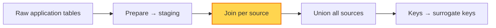

# Join

**Join** is the second transformation. Once the raw tables are cleaned into
[staging tables](./prepare.md), there are usually many of them. We join those
staging tables into a smaller number of consolidated, per-source tables.

## Rules

### Join per source

Build **one joined table per source system**. If there are three sources, you
should end up with three joined tables — not one giant join across everything.

- Different sources have different data structures, grains, and key conventions.
  Joining them all at once produces a big, messy join that is hard to read and
  debug.
- Consolidating per source first keeps each join focused and predictable, and
  isolates source-specific quirks before everything is brought together in the
  [union](./union.md) step.

### Keep the target grain in mind

Join staging tables up to the grain of the entity you are building (the fact or
dimension). Use `left join` so you don't silently drop rows when a lookup is
missing — a missing match is usually a data-quality signal worth surfacing.

## See also

- [Prepare](./prepare.md) — the staging tables that feed this step
- [Union](./union.md) — combine the per-source joined tables
- [Grain](../definitions/grain.md) — the level each joined table targets
