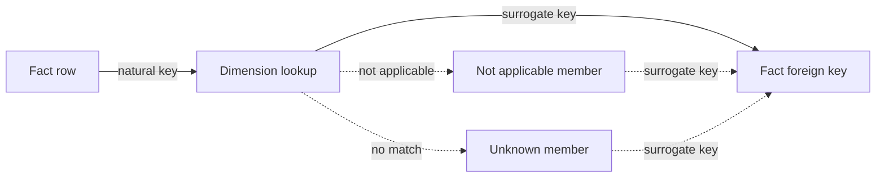

# Key Assignment

**Key assignment** is the final transformation. After sources are
[prepared](./prepare.md), [joined](./join.md), and [unioned](./union.md), each
fact gets the **surrogate keys** of its related dimensions. Dimensions carry their
own keys, generated as described in [Key Generation](../conventions/key-generation.md).
See [Kimball Keys Definitions](../concepts/kimball-keys.md) for the full set of
key types.


## Rules

### Resolve keys through the dimension

Following Kimball's **surrogate key pipeline**, the recommended approach is for
the fact to look up each dimension key on the natural key, rather than computing
it itself. Even with deterministic hashes, this:

- keeps key logic in one place;
- resolves SCD Type 2 versions correctly;
- handles Unknown and Not applicable members consistently.



### Fall back to Not applicable, then Unknown

- **Not applicable** — the relationship does not apply to the row (e.g. no
  currency conversion is needed).
- **Unknown** — the relationship should exist, but the natural key was not found.

Read both keys from the dimension and use them only when the main lookup returns
nothing. See [Unknown member](../patterns/unknown.md).

```sql
WITH na_<dim> AS (
    SELECT <dim>_sk FROM dim_<dim> WHERE <natural_key> = '<na_code>'
),
unknown_<dim> AS (
    SELECT <dim>_sk FROM dim_<dim> WHERE <natural_key> = '<unknown_code>'
)
SELECT
    ...,
    COALESCE(d.<dim>_sk, na.<dim>_sk, unk.<dim>_sk) AS <dim>_sk
FROM fact_<name> AS f
LEFT JOIN dim_<dim> AS d
    ON d.<natural_key> = f.<natural_key>
LEFT JOIN na_<dim> AS na
    ON <condition when the relationship does not apply>
LEFT JOIN unknown_<dim> AS unk
    ON d.<dim>_sk IS NULL
   AND na.<dim>_sk IS NULL;
```

### Resolve SCD Type 2 versions by event date

In an [SCD Type 2](../conventions/slowly-changing-dimension.md) dimension, each
version has its own key. Match on the natural key **and** the event date:

```sql
LEFT JOIN dim_customer AS d
    ON d.customer_nk = f.customer_nk
    AND f.order_date BETWEEN d.valid_from AND d.valid_to
```

Versions should not overlap (fan-out), leave gaps, or have `NULL` validity dates
(false Unknowns).

### Don't re-derive keys in the fact

```text
COALESCE(d.customer_sk, MD5('UNKNOWN'))   -- avoid: the key now lives in two places
```

If the dimension's rule changes, the two drift apart and the join silently stops
matching.

## See also

- [Key Generation](../conventions/key-generation.md) — how surrogate keys are produced
- [Kimball Keys Definitions](../concepts/kimball-keys.md) — natural, surrogate, durable, and foreign keys
- [Unknown member](../patterns/unknown.md) — the reserved dimension row
- [Union](./union.md) — the step that feeds this transformation
