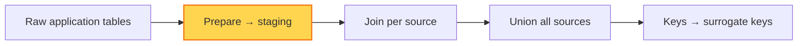

# Prepare

**Prepare** is the first transformation in the pipeline. It turns raw application
tables into clean **staging tables** that are ready for the later steps. You
should never build facts and dimensions directly on top of raw tables — always
stage first.

## Rules

### Staging tables are 1:1 with raw tables

Each staging table maps to exactly one raw application table, with the same grain
and (broadly) the same set of rows. Prepare is about *cleaning*, not *reshaping* —
stay close to the original table so it remains easy to trace a staged row back to
its source.

### Clean, don't aggregate

Typical SQL used to build staging tables:

- `CAST` — fix data types (text dates → `DATE`, numeric strings → `DECIMAL`).
- `TRIM` — strip stray whitespace from text fields.
- `SELECT` — pick and rename the columns you actually need.
- `WHERE` — drop obviously invalid rows (e.g. soft-deleted records, test data).

Avoid `GROUP BY` and aggregation at this stage. Changing the grain here makes the
downstream [join](./join.md) and [union](./union.md) steps harder to reason about.
Keep staging atomic and let aggregation happen later, in the reporting layer.

## See also

- [Join](./join.md) — consolidate prepared tables per source
- [Grain](../definitions/grain.md) — why staging keeps the raw grain
