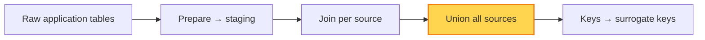

# Union

**Union** is the third transformation. The per-source [joined tables](./join.md)
all describe the same kind of entity (e.g. customers, invoice lines) but come from
different systems. Union stacks them into a single combined table.

## Rules

### Keep a `source_name` column

Every record must carry a `source_name` column identifying the system it came
from. When rows from multiple sources are combined, this column preserves the
lineage of each record so you can:

- trace any row back to the source that produced it,
- filter or group metrics by source, and
- debug discrepancies between sources.

### Align columns before unioning

A union requires every input to share the same column set, order, and types. Make
sure the [prepare](./prepare.md) and [join](./join.md) steps have already
reconciled column names and data types across sources, so the union is a clean
stack rather than a place to patch up mismatches.

## See also

- [Join](./join.md) — the per-source tables that feed the union
- [Keys](./keys.md) — add surrogate keys to the unioned table
